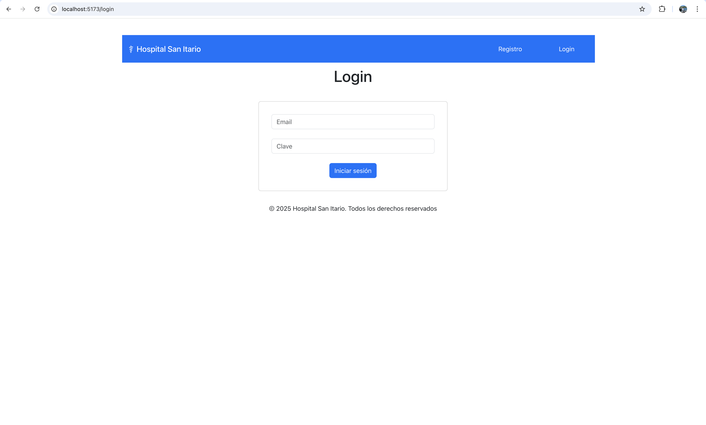

# Sitio Web Hospital San Itario (v4)
Repositorio que contiene la capa de front-end del sitio web del Hospital San Itario. Esta versión se desarrolló usando el framework React.

## Alumno
Felipe Cárdenas Molina

## Despliegue local
Para desplegar el sitio en su ambiente local, se debe realizar lo siguiente:

1. Clonar el repositorio del sitio web:
```
git clone git@github.com:pipecm/adalid-frontend-hospital-ts.git
```

2. Acceder a la carpeta recientemente descargada:
```
cd adalid-frontend-hospital-ts
```

3. Ejecutar el comando para instalar las dependencias de Bootstrap:
```
npm install
```

4. Ejecutar el comando para levantar localmente el servidor que provee de un entorno backend con `json-server`:
```
npm run server
```
Una vez levantado el servidor, éste se encontrará disponible en `http://localhost:3001`.

5. Ejecutar el comando para levantar localmente el sitio web:
```
npm run dev
```

6. Abrir un browser y acceder al sitio del hospital por medio de la siguiente URL:
```
http://localhost:5173
```

Si todo lo anterior se realizó correctamente, se debería visualizar el sitio web como en la imagen siguiente:



### Cuentas de usuario

|Email              |Clave          |Rol      | 
|-------------------|---------------|---------|
|pipecm@gmail.com   |12345          |patient  |
|jack@hsi.com       |doctorjack     |doctor   |
|admin@hsi.com      |adminhospital  |admin    |

## Ejercicio técnico Nº4 - Módulo 5
### Consumo de APIs usando Fetch API o Axios
Para el usuario `admin@hsi.com` se añadió una vista de dashboard, el cual contiene una tabla con la lista de doctores presentes en el sistema. Para el manejo de los datos, se creó un hook personalizado que provee las funciones REST para efectuar las operaciones CRUD correspondientes. Para crear, editar y borrar doctores en esta vista, se muestran mensajes de error en la ventana de ingreso/edición de datos.

### Integración de TypeScript en Componentes Clave
Los componentes relacionados con la gestión de formularios y el formulario de gestión de doctores (usado en la vista dashboard) se crearon usando TypeScript, añadiendo algunas validaciones de tipos de datos propias del lenguaje.

### Mejoras en la Seguridad del Front-End
Las mejoras en la seguridad fueron incorporadas en las tareas anteriores, entre las cuales destacan:
* Encriptación de datos antes de enviar a API
* Protección de llamadas a API mediante JWT
* Uso de React Router DOM para control de acceso a recursos protegidos
* Protección contra vulnerabilidades tales como XSS o inyecciones SQL.

### Optimización con Hooks y Manejo de Errores
Además de los hooks implementados con anterioridad para el manejo de formularios y autenticación, tal como se mencionó más arriba, se creó un nuevo hook para la gestión de las operaciones CRUD.


## Copyright
© 2025 Hospital San Itario. Todos los derechos reservados.